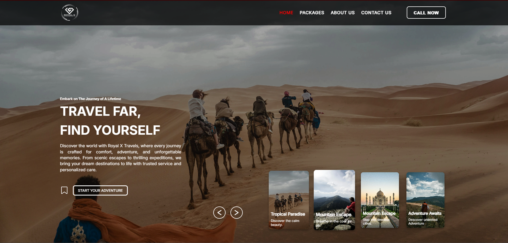
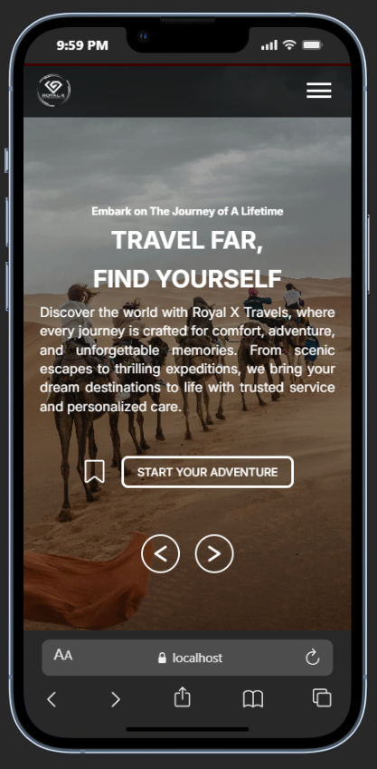

# Royal-X Travels - Travel & Tourism Web Application

This project is a comprehensive web platform developed to showcase travel packages and streamline customer inquiries. It was built during my 6-month Industrial Internship as a Web Developer, focusing on creating a seamless user experience and a professional interface.

##  Key Features
* **Dynamic Package Display:** Interactive cards and sections to showcase various tour packages.
* **Fully Responsive Design:** Optimized for a smooth experience across Mobile, Tablet, and Desktop devices.
* **Modern UI/UX:** High-quality animations and slider integrations (Home & About sliders).
* **Automated Inquiry System:** Integrated PHPMailer to allow users to send direct inquiries via email.
* **Performance Optimized:** Used WebP image formats and optimized assets for faster loading speeds.

##  Technologies Used
* **Frontend:** HTML5, CSS3, JavaScript (ES6+)
* **Backend:** PHP (Server-side logic & Form handling)
* **Libraries:** PHPMailer for email functionality
* **Design:** Custom CSS for unique branding and layout
* **Other Technologies:** Owl Carousel, SwiperJS

## Project Structure
* `Home/` - Homepage with featured tours and services.
* `Packages/` - Detailed view of available travel destinations.
* `About/` & `Contact/` - Company profile and lead generation forms.
* `Assets/` - Managed repository for optimized icons, fonts, and images.

## Project Preview

  
  

---
**Developed by:** Isuru Shehan 
